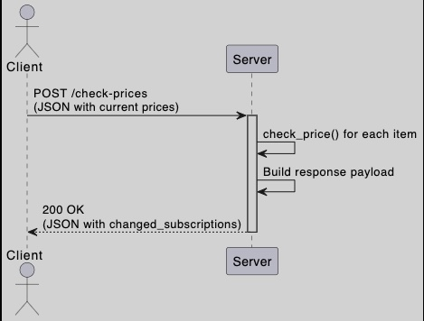

Subscription Price Checker Microservice

This microservice provides a price change notifcation system for a subscription tracker application. It receives a list of tracked subscriptions and their current prices, checks for any price updates, and returns a list of all subscriptions that have changed.

--------------------------------------------------------------

API Communication Contract

The microservice exposes a single REST API endpoint for communication.

Endpoint: `POST /check-prices`

This endpoint is used to check for price updates on one or more subscriptions.

--------------------------------------------------------------

Request Format

The client must send an HTTP POST request to the `/check-prices` endpoint. The body of the request must be a JSON object containing a single key, `subscriptions`, which holds an array of subscription objects.
Each subscription object in the array must have the following structure:
`id` (string, required): A unique identifier for the subscription (e.g., "netflix_standard").
`current_price` (float, required): The price currently stored in the main application for this subscription.

Example Request Body

```json
{
  "subscriptions": [
    {
      "id": "netflix_standard",
      "current_price": 15.49
    },
    {
      "id": "hulu_no_ads",
      "current_price": 12.99
    }
  ]
}

Response Format

The microservice will always reply with a JSON object. The structure of the response indicates whether any price changes were detected.
The response object will contain a single key, changed_subscriptions, which holds an array of objects.

Case 1: Price Changes Detected

If one or more prices have changed, the changed_subscriptions array will be populated with an object for each subscription that was updated.
Each object in the changed_subscriptions array will have the following structure:
•	id (string): The unique identifier of the subscription.
•	new_price (float): The newly detected price for the subscription.
•	old_price (float): The original price that was sent in the request.
Example Response (Changes Found)
{
  "changed_subscriptions": [
    {
      "id": "hulu_no_ads",
      "new_price": 14.99,
      "old_price": 12.99
    }
  ]
}

Case 2: No Price Changes

If the check is completed and no price discrepancies are found, the microservice will return the same structure, but the changed_subscriptions array will be empty. This confirms that the check was successful and no prices have changed.
Example Response (No Changes)
{
  "changed_subscriptions": []
}


UML sequence diagram




